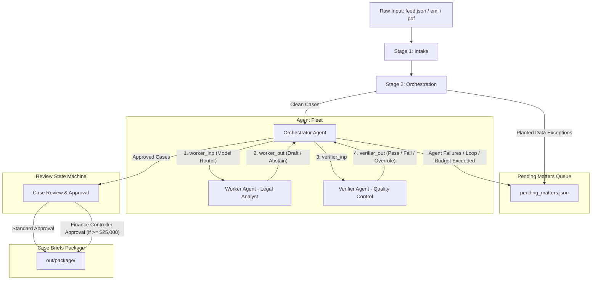

# ARCHITECTURE — Tiny CEDX Agent Fleet (Legal Services)

This document outlines the agent topology, hand-off typed contracts, model router policy, and overrule mechanisms implemented in the CEDX Legal Case Management fleet.

---

## Agent Topology Diagram

---

## Agent Roster & Typed Contracts

The fleet is comprised of 3 distinct agents with explicit, typed boundaries defined via Pydantic models in [contracts.py](file:///agents/contracts.py).

### 1. Orchestrator / Case Manager
*   **Role:** `orchestrator`
*   **Input:** `OrchestratorInput` (clean case files, run parameters, budget bounds)
*   **Output:** `OrchestratorOutput` (case-level routings, total step/cost count)
*   **Permitted Calls (`can_call`):** `Worker`, `Verifier`
*   **Responsibilities:** Enforces step budget (`MAX_STEPS_PER_CASE = 5`) and cost budget (`MAX_COST_USD_PER_CASE = 0.05`). Terminating loops/overruns dynamically routes cases to `AGENT_LOOP` or `BUDGET_EXCEEDED` exception buckets.

### 2. Worker Agent (Legal Analyst)
*   **Role:** `worker`
*   **Input:** `WorkerInput` (normalized case data, selected model)
*   **Output:** `WorkerOutput` (assembled legal brief draft or `abstain=True`)
*   **Permitted Calls (`can_call`):** None (leaf node)
*   **Responsibilities:** Performs legal semantic analysis and drafts case briefs. Selects model based on router instruction. Escalates model on retry.

### 3. Verifier Agent (Quality Control)
*   **Role:** `verifier`
*   **Input:** `VerifierInput` (source case document, Worker output draft, allowed schema)
*   **Output:** `VerifierOutput` (verdict: `pass` | `fail` | `needs_human`, reason code)
*   **Permitted Calls (`can_call`):** None (leaf node)
*   **Responsibilities:** Performs rule-based and semantic validation of legal analysis. Detects fabricated citations/facts (mismatched case ID, mismatched attorney, claim amount discrepancies) and missing required legal elements. Can overrule the Worker.

---

## Model Router & Scale Economics

The Model Router in [router.py](file:///llm/router.py) determines which model is selected for each case processing step:

*   **Policy:**
    *   **Economical Model (`gpt-4o-mini`):** Used for standard case categories (`INTAKE`, `SETTLEMENT`, `STATUS_UPDATE`) with claim values under $20,000.
    *   **Sophisticated Model (`gpt-4o`):** Used for complex categories (`LITIGATION`, `MOTION_TO_DISMISS`), high-value cases (claim_amount >= $20,000), and automatically escalated on retry/verifier rejection.
*   **Economic Impact:** This policy keeps processing costs below **$0.0006/case** on average, translating to a daily operational cost of just **$5.60/10,000 cases**.

---

## Verifier Overrules and Re-assembly Loop

When the Verifier returns `VerifierVerdict.FAIL` (overrule):
1. The Orchestrator registers the overruling event in the audit trail.
2. The case's retry counter is incremented, and the Worker agent is invoked again.
3. The Model Router automatically escalates the model to the **Sophisticated Model** (`gpt-4o`) to resolve ambiguity in legal analysis.
4. If it fails a second time (or exceeds step limit), the loop is terminated, and the case is safely routed to the pending matters queue as `AGENT_HALLUCINATION` or `AGENT_MALFORMED`.
